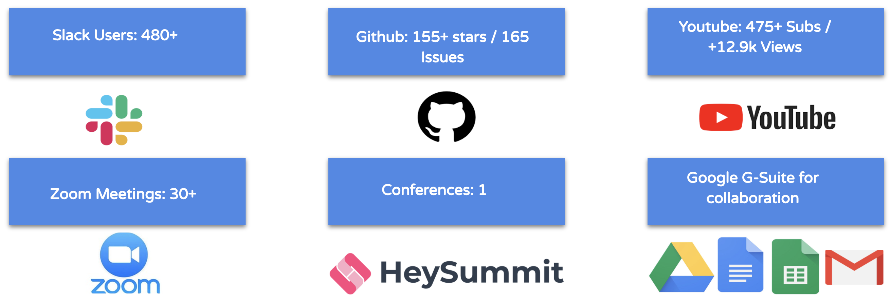
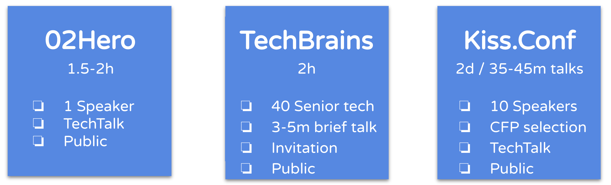

# Main Repo

By solid engineers for solid engineers.

## Core Projects

- [02hero](https://github.com/goupaz/02hero) Maintainer: [Sako M](https://www.linkedin.com/in/sakom/)
- [techbrains](https://github.com/goupaz/techbrains) Maintainer: [Sako M](https://www.linkedin.com/in/sakom/)
- [kiss.conf](https://github.com/goupaz/kiss.conf) Maintainer: [Nabi Nabizade](https://www.linkedin.com/in/nabi-nabizade/)

## Projects

### Sandbox 0-100 stars

- [Python Open Policy Agent (OPA) Client](https://github.com/Turall/OPA-python-client)
- [TSSG - The Swagger Schema Generator](https://github.com/tauqeernasir/tssg-editor) Maintainer: [Tauqeer Nasir](https://www.linkedin.com/in/tauqeer-nasir-767624111/)
- [Cloud native platform for Data Stream](https://github.com/infinyon/fluvio) Maintainer: [Sehyo Chang](https://www.linkedin.com/in/sehyo/)
- [Lowlevel](https://github.com/goupaz/lowlevel) Maintainer: [Emin Guliyev](https://www.linkedin.com/in/emin-ghuliev-461a22129/)
- [JobHax](https://github.com/job-hax) Maintainer: [Sako M](https://www.linkedin.com/in/sakom/)
- [Algo](https://github.com/goupaz/algo) Maintainer: [Sako M](https://www.linkedin.com/in/sakom/)
- [Cloudrally](https://github.com/goupaz/cloudrally) Maintainer: [Sako M](https://www.linkedin.com/in/sakom/)

### Incubating 100-1000 stars
- [Meshery](https://github.com/layer5io/meshery) Maintainer: [Lee Calcote](https://www.linkedin.com/in/leecalcote)

### Graduate 1000+ stars
- [Ingress-nginx](https://github.com/kubernetes/ingress-nginx) Maintainer: [Elvin Efendi](https://www.linkedin.com/in/elvinefendi/)

## Roles

- Maintainers
1. [Rovshan Musayev](https://www.linkedin.com/in/rovshan-musayev/)
2. [Emin Guliyev](https://www.linkedin.com/in/emin-ghuliev-461a22129/)
3. [Elshad Agazade](https://www.linkedin.com/in/elshadaghazadeh/)
4. [Nabi Nabizade](https://www.linkedin.com/in/nabi-nabizade/)
5. [Tauqeer Nasir](https://www.linkedin.com/in/tauqeer-nasir-767624111/)
6. [Sako M](https://www.linkedin.com/in/sakom/)

- Contributors
- Staff: Community Manager
- Community

## Partners

- Silver
- [ ] [erpgo](https://erpgo.az/)
- Gold
- Platinum
- Academic Non-Profit
- [ ] [Expertech](http://expertech.az/)
- [ ] [Tech Academy](https://www.tech.edu.az/)
- [ ] [Pragmatech](http://pragmatech.az/)
- [ ] [Ingress Academy](http://ingress.az/)
- [ ] [Itcity](https://itcity.academy/)
- SIG - Special Interest Groups

## About Us

### Who we are?
The GOUP project is the idea of a Azerbaijani tech community living abroad.

### Mission
Build bridges between tech professionals in a collaborative ways across the borders.

### Vision
Make the world better place to live, using technology and right culture.

### Objectives
Build egoless, collaborative, competent,  decentralized, scalable, fun community culture.
Our goal is simple to structure and index the data flow within communities. 

## Contact
You can join us:

[Slack](https://bit.ly/2wSJ5db)

[Youtube](https://www.youtube.com/goupaz)

[Facebook](https://www.facebook.com/goupaz)
